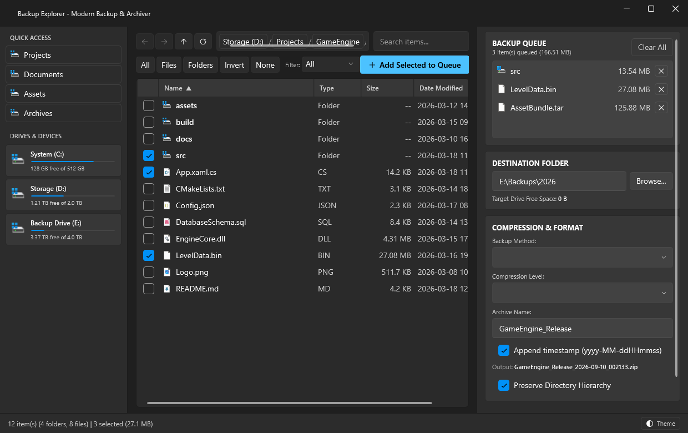
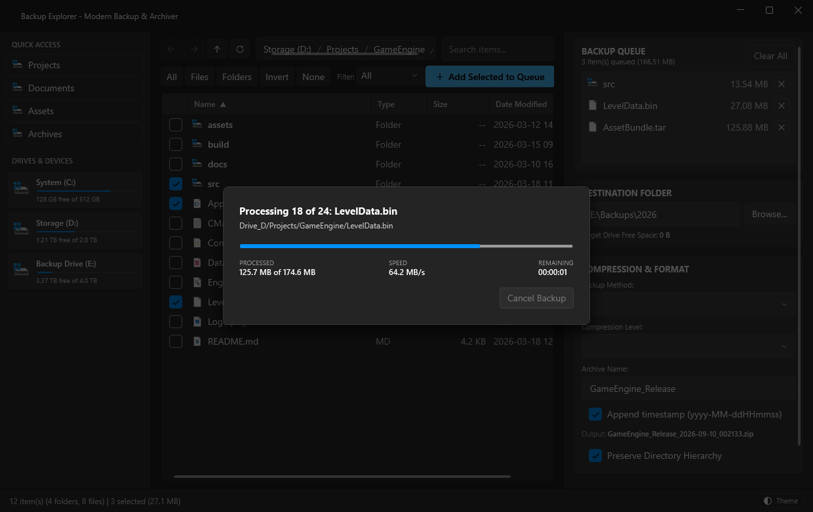

# Backup Explorer

A modern, high-performance Windows backup and archiving utility built on **.NET 8** and **WPF** featuring **Windows 11 Fluent 2 Design** (`WPF-UI`) and **SharpCompress**. 
Made for personal use, but it turned out quite useful so i decided to share.

---

## Screenshots

| File Explorer & Backup Configuration | Live Streaming Compression Progress |
| :---: | :---: |
|  |  |

---

## Features

*  **Built-in File Explorer**:
  * Integrated drive storage usage gauges and Windows Quick Access shortcuts.
  * Interactive column sorting (**Name**, **Type**, **Size**, **Date Modified**) with ascending/descending indicators.
  * Multi-item selection with keyboard navigation, spacebar toggle, and bulk selection tools (*All*, *Files*, *Folders*, *Invert*, *None*).
  * Checkmark persistence across directory navigation and history (Back/Forward).

*  **Automatic Multi-Drive Namespacing**:
  * Back up files and folders spanning multiple storage drives (`C:\`, `D:\`, network shares) in a single job.
  * Automatically isolates volumes (`Drive_C/...`, `Drive_D/...`) to prevent name collisions across drives.
  * Preserves clean, natural folder structures for single-drive backups without unnecessary prefixing.

*  **Compression & Packaging Formats**:
  * **Direct Copy (Mirror)**: Fast uncompressed mirror with preserved folder hierarchies.
  * **ZIP Archive (`.zip`)**: Standard zip format with adjustable compression levels (Store, Fast, Normal, Maximum, Ultra).
  * **7-Zip Archive (`.7z`)**: High-compression LZMA archive.
  * **TAR Archive (`.tar`)**: Uncompressed Unix tarball.
  * **TAR.GZ Archive (`.tar.gz`)**: GZip-compressed tarball.

*  **Zero "C: Drive Limbo" Streaming**:
  * Reads source files and streams compressed data **directly to your chosen destination directory**.
  * No temporary staging files created on `C:\` or in `%TEMP%`, preserving SSD endurance and preventing disk space exhaustion.

*  **Real-Time Progress & Throttle Control**:
  * Live intra-file streaming progress, speed (MB/s), elapsed time, and ETA calculations.
  * Throttled UI dispatching to keep the interface smooth and responsive.
  * Instant cancellation with automatic cleanup of incomplete files.

*  **Single-File Standalone Executable**:
  * Packaged into a clean, standalone single `.exe` file (`publish\Lightweight\BackupExplorer.exe`) with zero loose DLLs or debug files.

---

## Project Structure

```
BackupExplorer/
├── BackupExplorer.sln             # Visual Studio / dotnet Solution
├── src/
│   ├── BackupExplorer.Core/       # Core Archiving & Backup Engine (.NET 8)
│   │   ├── Models/               # Data contracts (BackupConfig, BackupItem, Progress, Result)
│   │   └── Services/             # IBackupEngine & BackupEngine implementation
│   │
│   └── BackupExplorer.App/        # Windows 11 Fluent 2 WPF Application
│       ├── Converters/           # WPF XAML value converters
│       ├── Models/               # UI models (ExplorerItem, DriveOrFolderItem, StagedItem)
│       ├── Services/             # ShellIconService (Windows API shell icons)
│       └── ViewModels/           # MVVM ViewModels (Explorer, Config, Execution, Main)
│
└── tests/
    └── BackupExplorer.Tests/      # xUnit automated test suite (14 passing tests)
```

---

## Getting Started

### Prerequisites
* Windows 10/11 (64-bit)
* [.NET 8.0 SDK](https://dotnet.microsoft.com/download/dotnet/8.0) or higher

### Build & Run Locally
```powershell
# Clone the repository
git clone https://github.com/tyskidzik/BackupExplorer.git
cd BackupExplorer

# Run tests
dotnet test

# Launch the app
dotnet run --project src/BackupExplorer.App
```

### Build Standalone Executables
Run standard `dotnet publish`:
```powershell
# Lightweight single-file EXE (~9 MB, requires .NET 8 on the PC):
dotnet publish src/BackupExplorer.App -c Release -r win-x64 --self-contained false -p:PublishSingleFile=true -p:DebugType=None -o publish/Lightweight

# 100% Self-Contained standalone EXE (runs on any Windows PC without .NET):
dotnet publish src/BackupExplorer.App -c Release -r win-x64 --self-contained true -p:PublishSingleFile=true -p:IncludeNativeLibrariesForSelfExtract=true -p:DebugType=None -o publish/Standalone
```

---

## License
Distributed under the MIT License. See `LICENSE` for more information.
